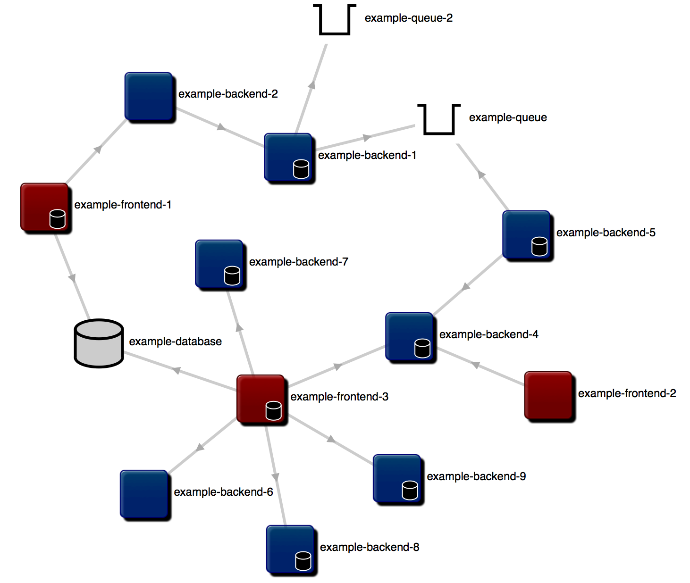

Arch-Draw
=========

Arch-draw is a javascript library to dynamically draw software/application architecture. If you have several applications that interact with each other then you can draw them and how they depend upon each other using Arch-draw.  

It uses [d3](http://d3js.org/) to draw the architecture and uses data in one of two ways:

1. All the information about all the applications goes in one file called services.json. Arch-draw takes that file and draws out the architecture based upon that information.

2. A link to each repository within the architecture is held within the file repos.json. Arch-draw will go to each repository in turn and interpret what it finds there. At the moment it looks for a file called service.json, which should contain information about the service and the names of the other services that it depends upon. Arch-draw will take this information and repo by repo draw the architecture.

Below is an example of what can be drawn:

The red components are frontend applications.
The blue ones are backend applications.
The little buckets are queues.
The cylinders are databases.

What you can't see from the picture above is that you can drag each component around to re-arrange the architecture as you want, and when hovering over a component it displays details of that component.

Finally, if a url for the component has been supplied, you can double click the component and it will take you to the source code.
